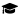

I am a _Theoretical and Computational Chemist_ with a passion for reaction mechanisms and transition state hunting. I currently work on catalysis but I have extensive experience in simulating systems of biological interest (proteins, drug molecules and cellular membranes). My computational techniques span from all atom Molecular Dynamics to Density Functional Theory. I can program in python and I am eager to implement AI/ML in my research.  

My **areas of specialization** include _Reactivity_, _Catalysis_, _DFT_, _Biomolecular Simulations_, _Molecular Dynamics_ and _Drug Design_.  
**I am interested in** _science communication_, _graphic design_, _acrobatics_, _cooking_ and learning new _languages_.  
**I advocate for** _labour rights_ and _gender equality_ in science.   

I am fluent in _greek_, _english_ and _spanish_, I have some basic knowledge of _swedish_ and _french_ and I am currently learning _italian_!

### Education

#### 2016-2021
 **Ph.D. in Computational Organic Chemistry**  
_National and Kapodistrian University of Athens, Greece_
Master in Theoretical Chemistry Uppsala University, Sweden 
Degree in ChemistryNational and Kapodistrian University of Athens, Greece
